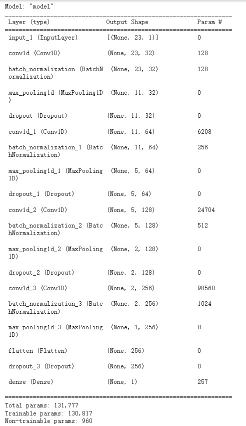
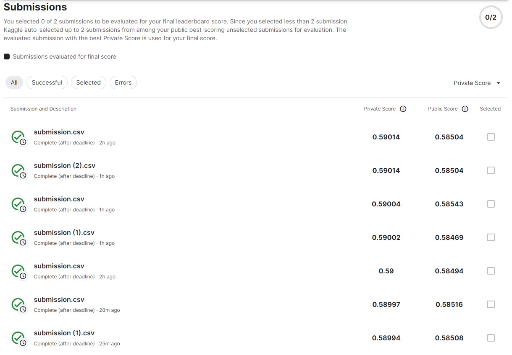

# Introduction-to-Machine-Learning Final Project

## Environment
* python: 3.8.16
* tesorflow: 2.9.2
* pytorch: 1.13.0+cu116
* keras: 2.9.0

## How to reproduce the work
First install the package(for google colab)
```bash
!pip install -q keras
!pip install tensorflow
```

## Train the model
After create the environment, you can run `109550139_Final_train.ipynb` to train the model.

The following structure is the CNN model structure:



Also, you can skip this step and directly use `109550139_Final_inference.ipynb` to evaluate the model performace.
>P.S. Since we save the trained model as `model.h5`, we need to download [the model](https://drive.google.com/drive/folders/1bKJTxncll687Rdsdr0xXWU_3BLsR8fR0) first, then run `109550139_Final_inference.ipynb`.

## Evaluate
Use `109550139_Final_inference.ipynb` to evaluate the model performace.

If you want to evaluate the model performance durectly, you need to download [the model](https://drive.google.com/drive/folders/1bKJTxncll687Rdsdr0xXWU_3BLsR8fR0) first, then run `109550139_Final_inference.ipynb`.

## Results
After finishing `109550139_Final_inference.ipynb`, you will get `submission.csv`.

Here is the accuracy result:


| Submission         | Private Score   | Public Score   |
| ------------------ |---------------- | -------------- |
| submission.csv     |     0.59014     |      0.58504   |
